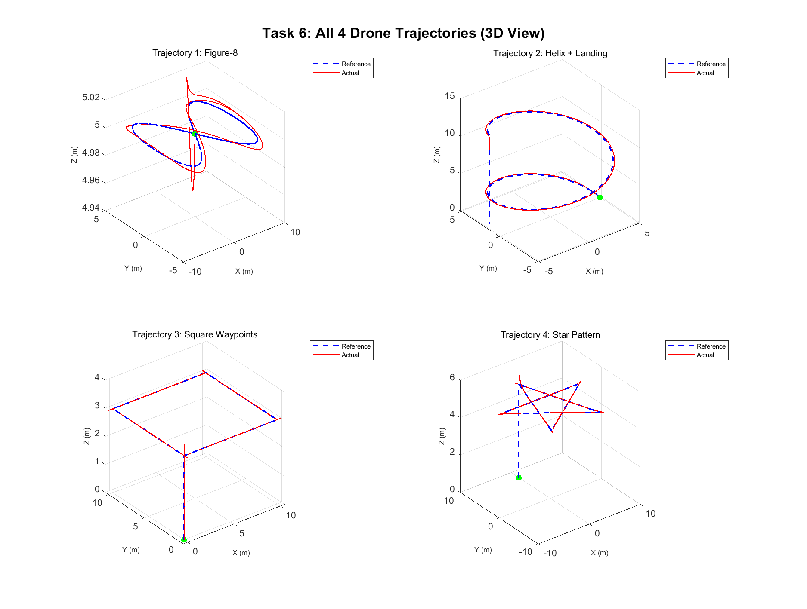
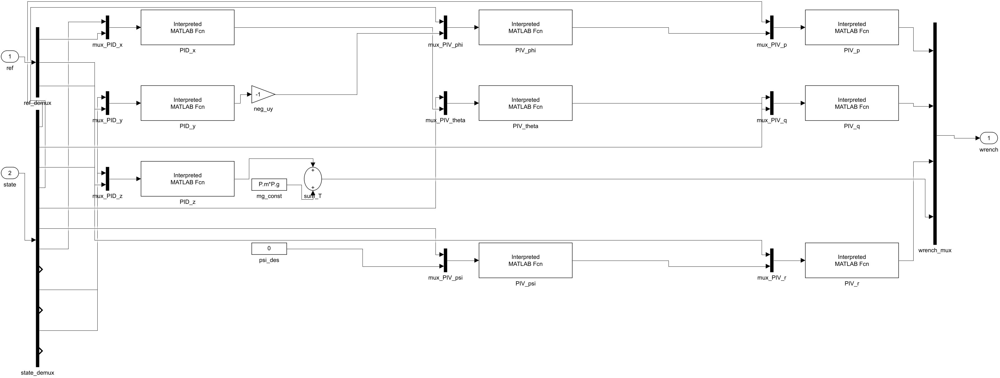
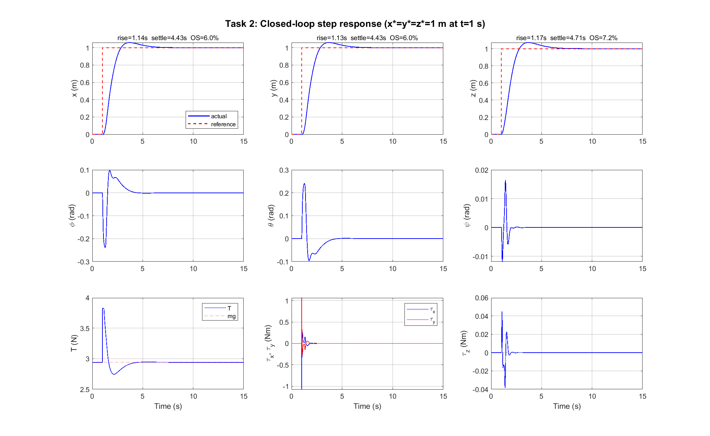
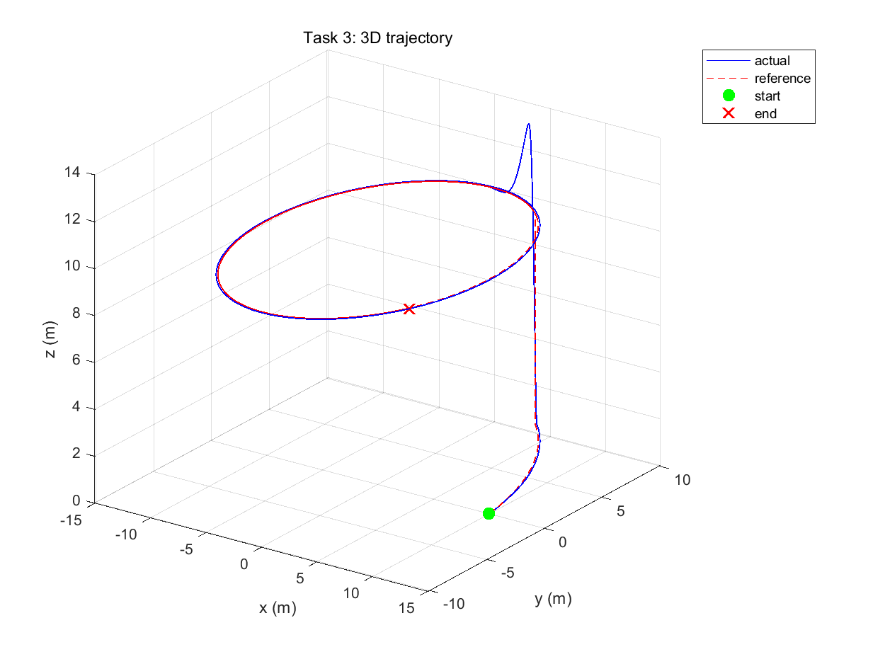
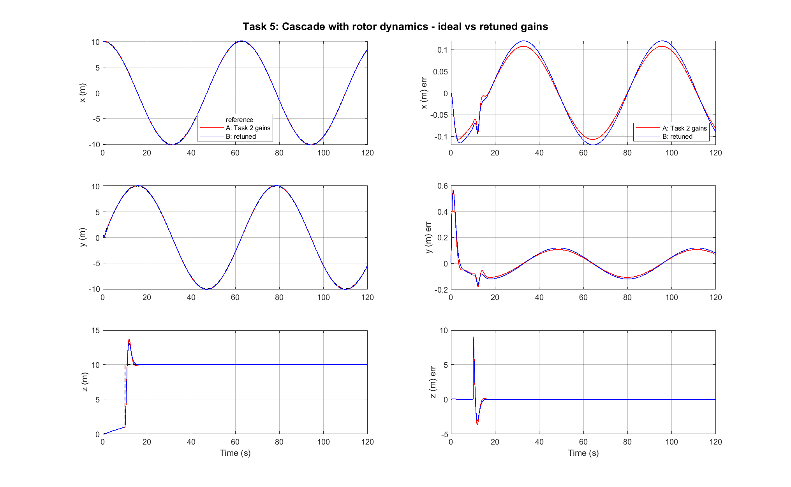
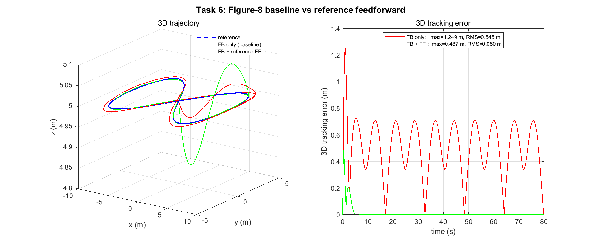
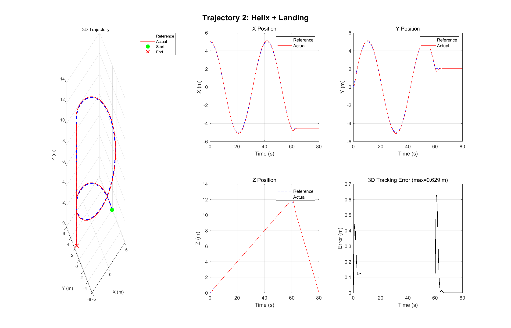
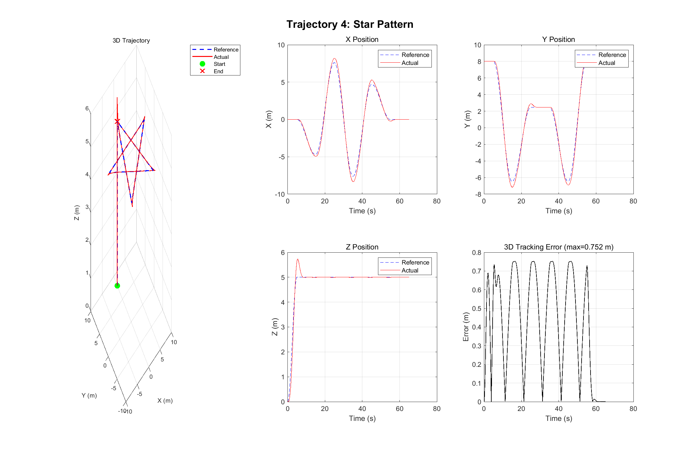

# Quadrotor Cascade Control Simulation

**Nonlinear drone dynamics, cascaded PID/PI control, rotor actuator modelling
and trajectory tracking in MATLAB + Simulink.**

This public repository is a cleaned project showcase for a quadrotor control
simulation. It presents the control design, system architecture and generated
results without publishing the original packaged archive, formal report,
personally identifying metadata or implementation source files.

<p align="center">
  
</p>

## Project Scope

The system models a 12-state quadrotor plant and controls it through a
time-scale-separated cascade. The implementation was developed in MATLAB for
fast numerical experiments and mirrored in Simulink for block-level validation.

Key engineering goals:

- Validate nonlinear translational and rotational dynamics against small-signal
  expectations.
- Design a three-loop cascaded controller for position, attitude and body-rate
  regulation.
- Add a realistic rotor chain with mixer allocation and first-order motor lag.
- Track a required spiral reference, then stress the controller with figure-8,
  helix, square and star trajectories.
- Compare baseline tracking, rotor-aware retuning and reference-feedforward
  improvements using quantitative metrics and visual outputs.

## Control Architecture

The controller follows the standard separation between slow position dynamics,
medium-bandwidth attitude dynamics and fast body-rate dynamics.

| Layer | Controlled states | Controller type | Design role |
|---|---|---|---|
| Outer loop | `x`, `y`, `z` | PID | converts position error into desired thrust and attitude commands |
| Middle loop | `phi`, `theta`, `psi` | PI | tracks desired roll, pitch and yaw angles |
| Inner loop | `p`, `q`, `r` | PI | regulates angular rates and produces body torques |
| Actuator layer | four rotors | mixer + motor lag | maps wrench demand into rotor-speed commands |

The simulated wrench convention is:

```text
[tau_x; tau_y; tau_z; T]
```

The actuator model applies the following chain before the nonlinear plant:

```text
wrench demand -> inverse mixer -> rotor-speed command
              -> first-order motor response -> mixer -> plant input
```

<p align="center">
  
</p>

## Results Snapshot

| Experiment | Outcome |
|---|---|
| Plant validation | isolated-channel nonlinear responses stayed within about `1e-4 m` of the small-signal prediction over a short horizon |
| 1 m step tracking | rise time around `1.14 s`, 2 percent settling around `4.4-4.7 s`, overshoot below `7.3%` |
| Spiral tracking | last-30-s RMS tracking error around `0.075 m` in `x` and `0.076 m` in `y` after altitude settling |
| Rotor-aware cascade | retuning recovered about `0.660 m` whole-horizon RMS-3D on the spiral with motor lag included |
| Creative trajectories | figure-8, helix landing, square and star references all completed with final 3D error below `4 cm` |
| Feedforward variant | smooth reference feedforward reduced the fast figure-8 final error to about `2 mm` |

<p align="center">
  
  
</p>

<p align="center">
  
  
</p>

## Trajectory Gallery

The creative trajectory set was selected to test different controller stresses:
smooth periodic curvature, vertical descent, sharp waypoint transitions and
multi-lobe planar motion.

<p align="center">
  
  
</p>

Rendered animations are included in `assets/videos/`:

- [`task3_spiral.mp4`](assets/videos/task3_spiral.mp4)
- [`task5_full_chain.mp4`](assets/videos/task5_full_chain.mp4)
- [`task6_traj_1_figure8.mp4`](assets/videos/task6_traj_1_figure8.mp4)
- [`task6_traj_2_helix_landing.mp4`](assets/videos/task6_traj_2_helix_landing.mp4)
- [`task6_traj_3_square.mp4`](assets/videos/task6_traj_3_square.mp4)
- [`task6_traj_4_star.mp4`](assets/videos/task6_traj_4_star.mp4)

## Technical Stack

- MATLAB numerical simulation
- Simulink block-diagram validation
- Cascaded PID/PI control
- Pole-placement gain design
- Rotor mixer and first-order motor dynamics
- Metrics, plots and MP4 trajectory rendering

## Repository Contents

```text
assets/
  figures/   selected plots and Simulink architecture screenshots
  videos/    rendered trajectory animations
README.md    public project overview
```

## Reproducibility Boundary

This repository is intentionally a public results archive rather than a reusable
MATLAB package. It includes selected plots, architecture screenshots, videos and
the control-design summary, but not the original source archive or Simulink
model files. The README therefore documents the design and measured behavior;
it does not provide a runnable quick start.

## Public Release Notes

This repository is intentionally presentation-focused. The implementation
source, Simulink model files, original packaged archive, formal PDF report and
personal identifiers are not included in the public release.
